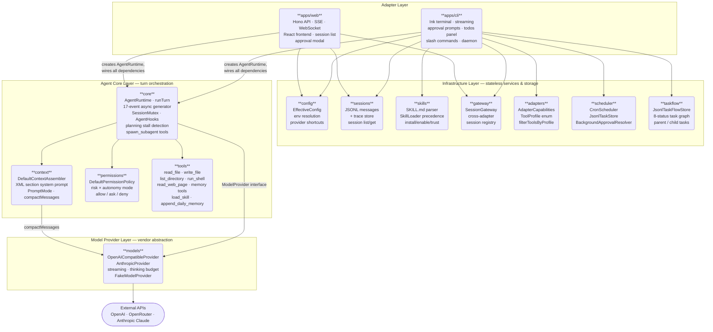
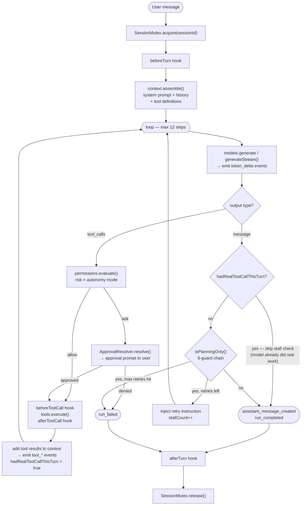

# Peewit

> A personal general-purpose agent — OpenClaw-inspired, TypeScript, real and usable.

[](https://www.typescriptlang.org/)
[](https://nodejs.org/)
[](https://pnpm.io/)
[](#development)

Simplified Chinese version: [README.zh-CN.md](./README.zh-CN.md)

---

## What is Peewit?

Peewit is a personal general-purpose agent built from first principles in TypeScript.

It is both a **real, usable product** and an **architecture learning project**. Every module — agent loop, tool execution, permission policy, context assembly, session storage, streaming, and multi-agent coordination — is implemented deliberately, documented thoroughly, and tested.

The reference architecture is [OpenClaw](https://openclaw.ai). Peewit implements its core ideas in a clean, staged, independently deployable TypeScript monorepo.

---

## Features

### Agent Core
- **Agent loop** — context assembly → model inference → tool execution → streaming replies → persistence
- **Streaming output** — token-by-token via SSE (Web) and Ink terminal rendering (CLI)
- **Planning stall detection** — detects plan-only turns and forces immediate action via retry injection
- **In-turn task tracking** — model-callable `update_todos` (equivalent to OpenClaw `update_plan`)
- **Sub-agent spawning** — `spawn_subagent` (blocking) and `spawn_subagent_async` (fire-and-forget) tools
- **Context compaction** — automatic conversation summarization before context overflow
- **Execution contracts** — `default` and `strict-agentic` modes for deeper planning discipline
- **Hooks** — `beforeTurn`, `afterTurn`, `beforeToolCall`, `afterToolCall`, `onCompaction` extension points
- **Session mutex** — per-session write locks for safe concurrent access

### Tools & Permissions
- **Built-in tools** — `read_file`, `list_directory`, `write_file`, `run_shell`, `read_web_page`, `append_daily_memory`
- **Memory tools** — `memory_search` (full-text search), `memory_get` (read a specific file), `load_skill` (on-demand SKILL.md loading)
- **Risk-based permission policy** — low / medium / high / blocked; `observe` / `confirm` / `auto` modes
- **Tool profiles** — `coding`, `full`, `messaging`, `background` capability sets per session
- **Sandbox enforcement** — shell tool can be scoped to workspace root, rejecting path traversal
- **Approval prompts** — interactive approval in both CLI and Web UI

### Context & Memory
- **XML-section system prompt** — identity, runtime, tooling, safety, skills, workspace sections
- **Prompt caching** — Anthropic `cache_control: ephemeral` on system blocks
- **Workspace bootstrap files** — `AGENTS.md`, `SOUL.md`, `USER.md`, `MEMORY.md`, `memory/YYYY-MM-DD.md`
- **Daily memory** — `append_daily_memory` tool for persistent notes
- **Session persistence** — JSONL-backed session and trace storage

### Skills
- **SKILL.md format** — `name` + `description` frontmatter, full body on demand
- **Precedence** — workspace > user (`~/.peewit/skills/`) > built-in
- **Skill management** — install, enable, disable, trust, review via CLI

### Adapters
- **CLI** — Ink-based terminal UI with streaming, approval prompts, todos panel
- **Web UI** — Hono API server + React frontend; sessions list, streaming chat, approval modal
- **Cross-adapter sessions** — CLI and Web share the same `JsonlSessionStore`
- **Session Gateway** — `packages/gateway` tracks active sessions across adapters

### Background Automation
- **One-shot tasks** — `peewit run "<goal>" [--mode auto|confirm]`
- **Cron daemon** — `peewit daemon` runs scheduled tasks from `tasks/*.task.json`
- **TaskFlow** — persistent cross-session task graph with 8 statuses and parent/child relationships
- **Background approval policy** — `BackgroundApprovalResolver` auto-approves or auto-denies
- **Task history** — `peewit tasks` and `peewit taskflow list/show/cancel`
- **Memory dreaming** — `peewit run --dream` consolidates daily notes into `MEMORY.md`

### Model Providers
- **OpenAI-compatible** — any API following OpenAI chat completions (OpenAI, OpenRouter, Ollama, etc.)
- **Anthropic** — native SDK with prompt caching, streaming, and extended thinking
- **Thinking budget** — `off` / `minimal` / `low` / `medium` / `high` / `max` / `adaptive` for Anthropic reasoning depth

---

## Quick Start

**Requirements:** Node.js ≥ 22, pnpm

```bash
git clone https://github.com/your-username/peewit
cd peewit
pnpm install
```

**Set your API key** — copy `.env.example` to `.env` and fill in your key:

```bash
cp .env.example .env
```

Minimal `.env` for OpenRouter:

```bash
OPENROUTER_API_KEY=sk-or-...
PEEWIT_MODEL=anthropic/claude-3-haiku
```

**Start chatting** (no build step required):

```bash
pnpm cli chat
```

---

## Usage

### CLI

The `pnpm cli` shortcut runs the CLI directly from source — no build step needed during development.

```bash
pnpm cli chat                           # Start interactive streaming chat (Ink UI)
pnpm cli chat --session <id>           # Named session
pnpm cli chat --resume                 # Resume most recent session
pnpm cli run "<goal>"                  # One-shot background task (default: confirm mode)
pnpm cli run "<goal>" --mode auto      # Auto-approve low/medium risk tools
pnpm cli tasks                         # List recent background task runs
pnpm cli tasks --limit 5
pnpm cli sessions                      # List stored sessions
pnpm cli skills                        # List loaded skills with trust status
pnpm cli skills install <path>         # Install a skill from a .md file
pnpm cli skills enable <name>
pnpm cli skills disable <name>
pnpm cli skills trust <name>
pnpm cli skills review <name>
pnpm cli daemon                        # Start the cron scheduler daemon
pnpm cli taskflow list                 # List all task flow records
pnpm cli taskflow show <id>            # Show a specific task
pnpm cli taskflow cancel <id>          # Cancel a running task
pnpm cli run "<goal>" --dream          # Memory dreaming — consolidate daily notes
```

### Web UI

```bash
pnpm --filter @peewit/web run dev   # Hono on :3120, Vite on :5173
```

Open `http://localhost:5173` in your browser. Create or resume sessions, send messages, watch streaming responses, approve tool actions.

API endpoints:
- `POST /api/sessions` — create or resume a session
- `GET /api/sessions` — list sessions
- `POST /api/sessions/:id/turns` — run a turn (SSE stream)
- `POST /api/sessions/:id/approvals` — resolve a pending approval
- `GET /api/gateway/sessions` — active sessions across all adapters
- `GET /ws/:id` — WebSocket connection for bidirectional communication

---

## Architecture

Peewit is a pnpm monorepo with 12 packages and 2 adapter apps, organized into four strict layers. Packages own a single responsibility. Adapters wire everything together. Nothing in the core imports from adapters. No circular dependencies.

### Module Map



**Dependency rules:**
- Adapters (`apps/cli`, `apps/web`) own all wiring — they create `AgentRuntime` and inject every dependency.
- `core` never imports from apps or infrastructure packages; it only depends on `context`, `permissions`, `tools`, and the `ModelProvider` interface.
- Infrastructure packages (`config`, `sessions`, `skills`, `gateway`, `adapters`, `scheduler`, `taskflow`) are standalone — they do not import from `core`.
- `models` is the deepest package; nothing it imports knows about agent logic.

### Turn Execution Flow

What happens inside a single `AgentRuntime.runTurn()` call:



### Package List

```
packages/
  core/         AgentRuntime, 17-event system, spawn_subagent, streaming, stall detection
  context/      System prompt assembly (XML sections), prompt caching, compactMessages
  models/       OpenAI-compatible + Anthropic providers, streaming, thinking budget
  tools/        Built-in tools, sandbox enforcement, memory tools, load_skill
  permissions/  Risk-based permission policy, autonomy modes (observe/confirm/auto)
  sessions/     JSONL session + trace storage
  skills/       SKILL.md parser, SkillLoader, SkillManager lifecycle
  adapters/     AdapterCapabilities, ToolProfile, filterToolsByProfile
  config/       Configuration loading, env overrides, provider shortcuts, redaction
  scheduler/    CronScheduler, BackgroundApprovalResolver, JsonlTaskStore
  taskflow/     TaskRecord, JsonlTaskFlowStore — persistent cross-session task graph
  gateway/      SessionGateway — cross-adapter session registry

apps/
  cli/          Ink terminal adapter (streaming, approval prompts, todos, slash cmds)
  web/          Hono server + React frontend (SSE, approval modal, sessions list)
```

### Package Documentation

Each package has a detailed README covering architecture, core concepts, implementation principles, and design decisions.

| Package | Role | README |
|---|---|---|
| `packages/core` | Agent loop, event system, hooks, subagent spawning | [README](./packages/core/README.md) |
| `packages/context` | System prompt assembly, PromptMode, compactMessages | [README](./packages/context/README.md) |
| `packages/models` | ModelProvider, Anthropic + OpenAI-compatible providers, streaming | [README](./packages/models/README.md) |
| `packages/tools` | Built-in tools, workspace boundary, sandbox, memory tools | [README](./packages/tools/README.md) |
| `packages/permissions` | Risk-based permission policy, autonomy modes | [README](./packages/permissions/README.md) |
| `packages/sessions` | JSONL session and trace storage, replay | [README](./packages/sessions/README.md) |
| `packages/skills` | SKILL.md parser, SkillLoader, SkillManager lifecycle | [README](./packages/skills/README.md) |
| `packages/adapters` | AdapterCapabilities, ToolProfile, filterToolsByProfile | [README](./packages/adapters/README.md) |
| `packages/config` | Config loading, env vars, provider shortcuts, redaction | [README](./packages/config/README.md) |
| `packages/scheduler` | CronScheduler, BackgroundApprovalResolver, JsonlTaskStore | [README](./packages/scheduler/README.md) |
| `packages/taskflow` | Persistent cross-session task graph, TaskRecord | [README](./packages/taskflow/README.md) |
| `packages/gateway` | SessionGateway — cross-adapter session registry | [README](./packages/gateway/README.md) |

---

## Configuration

All settings are optional. Peewit has safe defaults.

| Environment Variable | Description | Default |
|---|---|---|
| `ANTHROPIC_API_KEY` | Use Anthropic provider (claude-haiku-4-5) | — |
| `OPENROUTER_API_KEY` | Use OpenRouter (requires `PEEWIT_MODEL`) | — |
| `PEEWIT_API_KEY` | Generic API key | — |
| `PEEWIT_BASE_URL` | Provider base URL | `https://api.openai.com/v1` |
| `PEEWIT_MODEL` | Model name | `gpt-4.1-mini` |
| `PEEWIT_DEFAULT_MODE` | Autonomy mode: `observe` / `confirm` / `auto` | `confirm` |
| `PEEWIT_WORKSPACE_ROOT` | Working directory | `.` |
| `PEEWIT_LONG_TERM_MEMORY` | Memory policy: `disabled` / `read-only` / `write` | `disabled` |
| `PEEWIT_PROMPT_MODE` | Prompt rendering: `full` / `minimal` / `none` | `full` |
| `PEEWIT_EXECUTION_CONTRACT` | Execution discipline: `default` / `strict-agentic` | `default` |
| `PEEWIT_TOOL_PROFILE` | Tool capability set: `coding` / `full` / `messaging` / `background` | `full` |
| `PEEWIT_SANDBOX` | Restrict shell to workspace root: `true` / `false` | `false` |
| `PEEWIT_THINKING_BUDGET` | Anthropic reasoning depth: `off` / `minimal` / `low` / `medium` / `high` / `max` / `adaptive` | `adaptive` |

File-based config: `peewit.config.json` (project) and `~/.peewit/config.json` (user).

---

## Development

### Local setup

```bash
pnpm install          # install all dependencies
cp .env.example .env  # fill in your API key
pnpm cli chat         # run CLI from source, no build needed
```

### Running the Web UI locally

```bash
pnpm --filter @peewit/web run dev
# Hono API server: http://localhost:3120
# Vite dev server: http://localhost:5173
```

### Tests and checks

```bash
pnpm run check        # typecheck + vitest + docs parity check (run before every commit)
pnpm run typecheck    # TypeScript only
pnpm run test         # vitest only
pnpm run test:watch   # vitest in watch mode
pnpm run docs:check   # heading count parity (EN ↔ zh-CN)
```

### Building for production

```bash
pnpm run build                          # build all packages
node apps/cli/dist/index.js chat        # run built CLI
pnpm --filter @peewit/web run start  # run built Web server
```

### Adding a tool

1. Add an `ExecutableTool` factory in `packages/tools/src/index.ts`
2. Add a result type to `ToolExecutionResult` union
3. Register it in the appropriate adapter (`apps/cli` or `apps/web`)
4. Add tests in `packages/tools/src/index.test.ts`

### Adding a provider

1. Implement `ModelProvider` (or `StreamingModelProvider`) in `packages/models/src/index.ts`
2. Add config wiring in `packages/config/src/index.ts`
3. Add tests with an injectable fake client

---

## Documentation

| Document | Description |
|---|---|
| [Roadmap](./docs/roadmap/overview.md) | Phase plan, completion status |
| [Architecture docs](./docs/architecture/) | One doc per module |
| [Decisions](./docs/decisions/) | ADRs for key design choices |
| [Plans](./docs/plans/) | Per-phase implementation plans |
| [Research](./docs/research/) | OpenClaw implementation notes |

All documentation exists in English and Simplified Chinese.

---

## OpenClaw Alignment

Peewit is architecturally aligned with OpenClaw but not identical. See [Decision 0002](./docs/decisions/0002-openclaw-aligned-not-identical.md) for the rationale.

Current alignment:

| OpenClaw Capability | Peewit Status |
|---|---|
| Agent loop (intake → inference → tools → persist) | ✅ Complete |
| XML-section system prompt | ✅ Complete |
| Prompt caching | ✅ Anthropic `cache_control` |
| `update_plan` / in-turn task tracking | ✅ `update_todos` tool |
| Planning stall detection + retry injection | ✅ Complete |
| Streaming output | ✅ SSE + `token_delta` events |
| SKILL.md format + skill index | ✅ Complete |
| Workspace bootstrap files | ✅ AGENTS.md, SOUL.md, USER.md, MEMORY.md, daily notes |
| Session persistence | ✅ JSONL store |
| Multi-adapter (CLI + Web) | ✅ Shared `AgentRuntime` |
| `sessions_spawn` sub-agents | ✅ `spawn_subagent` tool |
| Background tasks | ✅ `peewit run` |
| Skill install / trust / permissions | ✅ Phase 9 |
| Session gateway | ✅ `packages/gateway` |
| Context compaction | ✅ `compactMessages()` in `packages/context` |
| Skill body on-demand loading | ✅ `load_skill` tool |
| `memory_search` / `memory_get` tools | ✅ `packages/tools` |
| Prompt modes (full / minimal / none) | ✅ `PEEWIT_PROMPT_MODE` |
| Strict-agentic execution contract | ✅ `PEEWIT_EXECUTION_CONTRACT` |
| Per-session write locks | ✅ `SessionMutex` in `packages/core` |
| Hooks system | ✅ `AgentHooks` in `packages/core` |
| Tool profiles | ✅ `PEEWIT_TOOL_PROFILE` |
| Sandbox enforcement | ✅ `PEEWIT_SANDBOX` |
| Cron daemon | ✅ `peewit daemon` |
| TaskFlow (persistent task graph) | ✅ `packages/taskflow` |
| Async subagents | ✅ `spawn_subagent_async` tool |
| WebSocket support | ✅ `GET /ws/:id` |
| Thinking budget | ✅ `PEEWIT_THINKING_BUDGET` |
| Memory dreaming | ✅ `peewit run --dream` |

All 18 OpenClaw alignment gaps are closed. See [OpenClaw Alignment Plan](./docs/plans/openclaw-alignment.md) for implementation details.

---

## License

MIT
