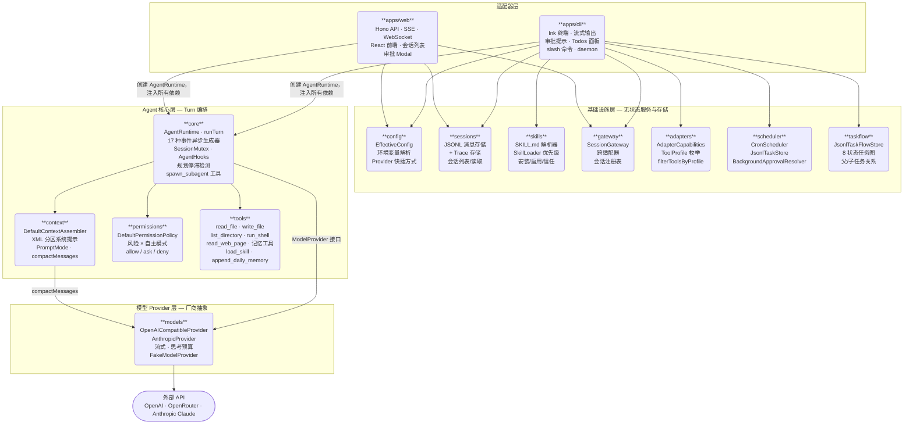
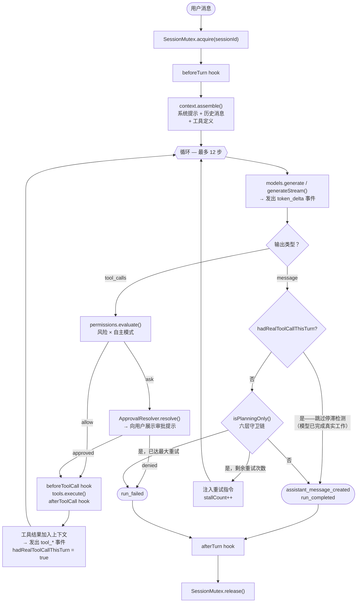

# Vole

> 个人通用 Agent — 受 OpenClaw 启发，TypeScript 实现，真实可用。

[](https://www.typescriptlang.org/)
[](https://nodejs.org/)
[](https://pnpm.io/)
[](#开发)

English version: [README.md](./README.md)

---

## 项目是什么？

Vole 是一个从零开始用 TypeScript 构建的个人通用 Agent。

它既是**真实可用的产品**，也是**架构学习项目**。每一个模块——Agent 循环、工具执行、权限策略、上下文组装、会话存储、流式输出、多 Agent 协调——都经过有意设计、详细文档记录和充分测试。

参考架构来自 [OpenClaw](https://openclaw.ai)。Vole 在干净、分阶段、独立可部署的 TypeScript monorepo 中实现了 OpenClaw 的核心理念。

---

## 功能特性

### Agent 核心
- **Agent 循环** — 上下文组装 → 模型推理 → 工具执行 → 流式回复 → 持久化
- **流式输出** — 逐 Token 输出，Web 端 SSE，CLI 端 Ink 终端渲染
- **规划停滞检测** — 检测纯规划轮次并通过重试注入强制立即行动
- **轮次内任务追踪** — 模型可调用的 `update_todos`（等同于 OpenClaw `update_plan`）
- **子 Agent 派生** — `spawn_subagent`（同步阻塞）和 `spawn_subagent_async`（即发即忘）
- **上下文压缩** — 上下文即将溢出前自动对历史对话进行摘要
- **执行契约** — `default` 和 `strict-agentic` 两种规划执行纪律模式
- **Hooks** — `beforeTurn`、`afterTurn`、`beforeToolCall`、`afterToolCall`、`onCompaction` 扩展点
- **会话互斥锁** — 每会话写锁，保障并发安全

### 工具与权限
- **内置工具** — `read_file`、`list_directory`、`write_file`、`run_shell`、`read_web_page`、`append_daily_memory`
- **记忆工具** — `memory_search`（全文搜索）、`memory_get`（读取指定文件）、`load_skill`（按需加载 SKILL.md）
- **基于风险的权限策略** — low / medium / high / blocked；`observe` / `confirm` / `auto` 模式
- **工具 Profile** — `coding`、`full`、`messaging`、`background` 四种会话能力集合
- **沙箱限制** — Shell 工具可限制在工作区根目录，拒绝路径穿越
- **审批提示** — CLI 和 Web UI 中均支持交互式审批

### 上下文与记忆
- **XML 段落系统提示词** — identity、runtime、tooling、safety、skills、workspace 六个段落
- **Prompt Caching** — Anthropic `cache_control: ephemeral` 缓存系统块
- **工作区启动文件** — `AGENTS.md`、`SOUL.md`、`USER.md`、`MEMORY.md`、`memory/YYYY-MM-DD.md`
- **日记记忆** — `append_daily_memory` 工具用于持久化笔记
- **会话持久化** — JSONL 格式的会话和 Trace 存储

### Skills 技能
- **SKILL.md 格式** — `name` + `description` frontmatter，全文按需加载
- **优先级** — 工作区 > 用户（`~/.vole/skills/`）> 内置
- **Skill 管理** — 通过 CLI 安装、启用、禁用、信任、查看

### 适配器
- **CLI** — 基于 Ink 的终端 UI，支持流式输出、审批提示、Todos 面板
- **Web UI** — Hono API 服务器 + React 前端；会话列表、流式聊天、审批 Modal
- **跨适配器会话** — CLI 和 Web 共享同一个 `JsonlSessionStore`
- **会话网关** — `packages/gateway` 跨适配器追踪活跃会话

### 后台自动化
- **一次性任务** — `vole run "<目标>" [--mode auto|confirm]`
- **Cron Daemon** — `vole daemon` 从 `tasks/*.task.json` 运行定时任务
- **TaskFlow** — 持久化跨会话任务图，支持 8 种状态和父子关系
- **后台审批策略** — `BackgroundApprovalResolver` 自动批准或拒绝
- **任务历史** — `vole tasks` 和 `vole taskflow list/show/cancel`
- **记忆整理** — `vole run --dream` 将日记文件整合写入 `MEMORY.md`

### 模型 Provider
- **OpenAI 兼容** — 遵循 OpenAI chat completions API 的任何服务（OpenAI、OpenRouter、Ollama 等）
- **Anthropic** — 原生 SDK，支持 Prompt Caching、流式输出和扩展思考
- **思考预算** — `off` / `minimal` / `low` / `medium` / `high` / `max` / `adaptive`，控制 Anthropic 推理深度

---

## 快速开始

**环境要求：** Node.js ≥ 22，pnpm

```bash
git clone https://github.com/your-username/vole
cd vole
pnpm install
```

**设置 API Key** — 复制 `.env.example` 为 `.env` 并填入你的 Key：

```bash
cp .env.example .env
```

OpenRouter 最简配置：

```bash
OPENROUTER_API_KEY=sk-or-...
VOLE_MODEL=anthropic/claude-3-haiku
```

**开始聊天**（无需构建）：

```bash
pnpm cli chat
```

---

## 使用方式

### CLI

`pnpm cli` 直接从源码运行，开发阶段无需构建。

```bash
pnpm cli chat                           # 启动流式交互聊天（Ink UI）
pnpm cli chat --session <id>           # 命名会话
pnpm cli chat --resume                 # 恢复最近会话
pnpm cli run "<目标>"                   # 一次性后台任务（默认 confirm 模式）
pnpm cli run "<目标>" --mode auto       # 自动批准 low/medium 风险工具
pnpm cli tasks                         # 列出最近后台任务运行记录
pnpm cli tasks --limit 5
pnpm cli sessions                      # 列出所有会话
pnpm cli skills                        # 列出已加载技能（含信任状态）
pnpm cli skills install <path>         # 从 .md 文件安装技能
pnpm cli skills enable <name>
pnpm cli skills disable <name>
pnpm cli skills trust <name>
pnpm cli skills review <name>
pnpm cli daemon                        # 启动 Cron 调度守护进程
pnpm cli taskflow list                 # 列出所有 TaskFlow 记录
pnpm cli taskflow show <id>            # 查看指定任务详情
pnpm cli taskflow cancel <id>          # 取消运行中的任务
pnpm cli run "<目标>" --dream           # 记忆整理 — 将日记合并进 MEMORY.md
```

### Web UI

```bash
pnpm --filter @vole/web run dev   # Hono 在 :3120，Vite 在 :5173
```

在浏览器打开 `http://localhost:5173`。创建或恢复会话、发送消息、查看流式响应、审批工具操作。

API 端点：
- `POST /api/sessions` — 创建或恢复会话
- `GET /api/sessions` — 列出会话
- `POST /api/sessions/:id/turns` — 运行对话轮次（SSE 流）
- `POST /api/sessions/:id/approvals` — 解析待处理审批
- `GET /api/gateway/sessions` — 所有适配器的活跃会话
- `GET /ws/:id` — WebSocket 连接，支持双向通信

---

## 架构

Vole 是一个包含 12 个 packages 和 2 个适配器应用的 pnpm monorepo，组织为四个严格分层。每个包只负责单一职责。适配器负责所有连接。核心层不向上依赖适配器。无循环依赖。

### 模块关系图



**依赖规则：**
- 适配器（`apps/cli`、`apps/web`）拥有所有连接逻辑 — 它们创建 `AgentRuntime` 并注入全部依赖。
- `core` 不导入 apps 或基础设施包；仅依赖 `context`、`permissions`、`tools` 和 `ModelProvider` 接口。
- 基础设施包（`config`、`sessions`、`skills`、`gateway`、`adapters`、`scheduler`、`taskflow`）是独立的，不导入 `core`。
- `models` 是最底层包，它不知道任何 agent 逻辑。

### Turn 执行流程

单次 `AgentRuntime.runTurn()` 调用的内部执行路径：



### 包列表

```
packages/
  core/         AgentRuntime、17 种事件系统、spawn_subagent、流式、停滞检测
  context/      系统提示组装（XML 段落）、Prompt Caching、compactMessages
  models/       OpenAI 兼容 + Anthropic Provider、流式、思考预算
  tools/        内置工具、沙箱限制、记忆工具、load_skill
  permissions/  基于风险的权限策略、自主模式（observe/confirm/auto）
  sessions/     JSONL 会话 + Trace 存储
  skills/       SKILL.md 解析器、SkillLoader、SkillManager 生命周期
  adapters/     AdapterCapabilities、ToolProfile、filterToolsByProfile
  config/       配置加载、环境变量覆盖、Provider 快捷方式、脱敏
  scheduler/    CronScheduler、BackgroundApprovalResolver、JsonlTaskStore
  taskflow/     TaskRecord、JsonlTaskFlowStore — 持久化跨会话任务图
  gateway/      SessionGateway — 跨适配器会话注册表

apps/
  cli/          Ink 终端适配器（流式、审批提示、Todos、slash 命令）
  web/          Hono 服务器 + React 前端（SSE、审批 Modal、会话列表）
```

### 包文档

每个包都有详细的 README，涵盖架构概述、核心概念、实现原理和设计决策。

| 包 | 职责 | 文档 |
|---|---|---|
| `packages/core` | Agent 循环、事件系统、Hooks、Subagent 派生 | [README](./packages/core/README.zh-CN.md) |
| `packages/context` | 系统提示组装、PromptMode、compactMessages | [README](./packages/context/README.zh-CN.md) |
| `packages/models` | ModelProvider、Anthropic + OpenAI 兼容 Provider、流式 | [README](./packages/models/README.zh-CN.md) |
| `packages/tools` | 内置工具、工作区边界、沙箱、记忆工具 | [README](./packages/tools/README.zh-CN.md) |
| `packages/permissions` | 基于风险的权限策略、自主模式 | [README](./packages/permissions/README.zh-CN.md) |
| `packages/sessions` | JSONL 会话和 Trace 存储、重放机制 | [README](./packages/sessions/README.zh-CN.md) |
| `packages/skills` | SKILL.md 解析器、SkillLoader、SkillManager 生命周期 | [README](./packages/skills/README.zh-CN.md) |
| `packages/adapters` | AdapterCapabilities、ToolProfile、filterToolsByProfile | [README](./packages/adapters/README.zh-CN.md) |
| `packages/config` | 配置加载、环境变量、Provider 快捷方式、脱敏 | [README](./packages/config/README.zh-CN.md) |
| `packages/scheduler` | CronScheduler、BackgroundApprovalResolver、JsonlTaskStore | [README](./packages/scheduler/README.zh-CN.md) |
| `packages/taskflow` | 持久化跨会话任务图、TaskRecord | [README](./packages/taskflow/README.zh-CN.md) |
| `packages/gateway` | SessionGateway — 跨适配器会话注册表 | [README](./packages/gateway/README.zh-CN.md) |

---

## 配置

所有设置均为可选，Vole 提供安全的默认值。

| 环境变量 | 说明 | 默认值 |
|---|---|---|
| `ANTHROPIC_API_KEY` | 使用 Anthropic Provider（claude-haiku-4-5） | — |
| `OPENROUTER_API_KEY` | 使用 OpenRouter（需配合 `VOLE_MODEL`） | — |
| `VOLE_API_KEY` | 通用 API Key | — |
| `VOLE_BASE_URL` | Provider Base URL | `https://api.openai.com/v1` |
| `VOLE_MODEL` | 模型名称 | `gpt-4.1-mini` |
| `VOLE_DEFAULT_MODE` | 自主模式：`observe` / `confirm` / `auto` | `confirm` |
| `VOLE_WORKSPACE_ROOT` | 工作目录 | `.` |
| `VOLE_LONG_TERM_MEMORY` | 记忆策略：`disabled` / `read-only` / `write` | `disabled` |
| `VOLE_PROMPT_MODE` | 提示词渲染：`full` / `minimal` / `none` | `full` |
| `VOLE_EXECUTION_CONTRACT` | 执行纪律：`default` / `strict-agentic` | `default` |
| `VOLE_TOOL_PROFILE` | 工具能力集：`coding` / `full` / `messaging` / `background` | `full` |
| `VOLE_SANDBOX` | 将 Shell 限制在工作区根目录：`true` / `false` | `false` |
| `VOLE_THINKING_BUDGET` | Anthropic 推理深度：`off` / `minimal` / `low` / `medium` / `high` / `max` / `adaptive` | `adaptive` |

文件配置：`vole.config.json`（项目级）和 `~/.vole/config.json`（用户级）。

---

## 开发

### 本地启动

```bash
pnpm install          # 安装所有依赖
cp .env.example .env  # 填入 API Key
pnpm cli chat         # 从源码运行 CLI，无需构建
```

### 本地运行 Web UI

```bash
pnpm --filter @vole/web run dev
# Hono API 服务器：http://localhost:3120
# Vite 开发服务器：http://localhost:5173
```

### 测试与检查

```bash
pnpm run check        # 类型检查 + vitest + 双语文档一致性（提交前必跑）
pnpm run typecheck    # 仅 TypeScript
pnpm run test         # 仅 vitest
pnpm run test:watch   # vitest 监听模式
pnpm run docs:check   # 双语标题数量一致性（EN ↔ zh-CN）
```

### 生产构建

```bash
pnpm run build                          # 构建所有包
node apps/cli/dist/index.js chat        # 运行构建后的 CLI
pnpm --filter @vole/web run start  # 运行构建后的 Web 服务器
```

### 添加工具

1. 在 `packages/tools/src/index.ts` 中添加 `ExecutableTool` 工厂函数
2. 在 `ToolExecutionResult` 联合类型中添加结果类型
3. 在对应适配器（`apps/cli` 或 `apps/web`）中注册
4. 在 `packages/tools/src/index.test.ts` 中添加测试

### 添加 Provider

1. 在 `packages/models/src/index.ts` 中实现 `ModelProvider`（或 `StreamingModelProvider`）
2. 在 `packages/config/src/index.ts` 中添加配置接入
3. 用可注入的 Fake 客户端添加测试

---

## 文档

| 文档 | 说明 |
|---|---|
| [路线图](./docs/roadmap/overview.zh-CN.md) | 阶段计划、完成状态 |
| [架构文档](./docs/architecture/) | 每个模块一篇文档 |
| [决策记录](./docs/decisions/) | 关键设计选择的 ADR |
| [计划文档](./docs/plans/) | 每阶段实施计划 |
| [研究资料](./docs/research/) | OpenClaw 实现笔记 |

所有文档均有英文和简体中文两个版本。

---

## OpenClaw 对齐情况

Vole 在架构上与 OpenClaw 对齐，但并不完全相同。详见 [Decision 0002](./docs/decisions/0002-openclaw-aligned-not-identical.md)。

当前对齐状态：

| OpenClaw 能力 | Vole 状态 |
|---|---|
| Agent 循环（intake → inference → tools → persist） | ✅ 完成 |
| XML 段落系统提示词 | ✅ 完成 |
| Prompt Caching | ✅ Anthropic `cache_control` |
| `update_plan` / 轮次内任务追踪 | ✅ `update_todos` 工具 |
| 规划停滞检测 + 重试注入 | ✅ 完成 |
| 流式输出 | ✅ SSE + `token_delta` 事件 |
| SKILL.md 格式 + Skill 索引 | ✅ 完成 |
| 工作区启动文件 | ✅ AGENTS.md、SOUL.md、USER.md、MEMORY.md、日记 |
| 会话持久化 | ✅ JSONL 存储 |
| 多适配器（CLI + Web） | ✅ 共享 `AgentRuntime` |
| `sessions_spawn` 子 Agent | ✅ `spawn_subagent` 工具 |
| 后台任务 | ✅ `vole run` |
| Skill 安装 / 信任 / 权限 | ✅ Phase 9 |
| 会话网关 | ✅ `packages/gateway` |
| 上下文压缩 | ✅ `packages/context` 中的 `compactMessages()` |
| Skill 按需加载 | ✅ `load_skill` 工具 |
| `memory_search` / `memory_get` 工具 | ✅ `packages/tools` |
| 提示词模式（full / minimal / none） | ✅ `VOLE_PROMPT_MODE` |
| Strict-agentic 执行契约 | ✅ `VOLE_EXECUTION_CONTRACT` |
| 每会话写锁 | ✅ `packages/core` 中的 `SessionMutex` |
| Hooks 系统 | ✅ `packages/core` 中的 `AgentHooks` |
| 工具 Profile | ✅ `VOLE_TOOL_PROFILE` |
| 沙箱限制 | ✅ `VOLE_SANDBOX` |
| Cron Daemon | ✅ `vole daemon` |
| TaskFlow（持久任务图） | ✅ `packages/taskflow` |
| 异步子 Agent | ✅ `spawn_subagent_async` 工具 |
| WebSocket 支持 | ✅ `GET /ws/:id` |
| 思考预算 | ✅ `VOLE_THINKING_BUDGET` |
| 记忆整理 | ✅ `vole run --dream` |

全部 18 个 OpenClaw 对齐缺口已全部关闭。详见 [OpenClaw 对齐计划](./docs/plans/openclaw-alignment.zh-CN.md)。

---

## License

MIT
