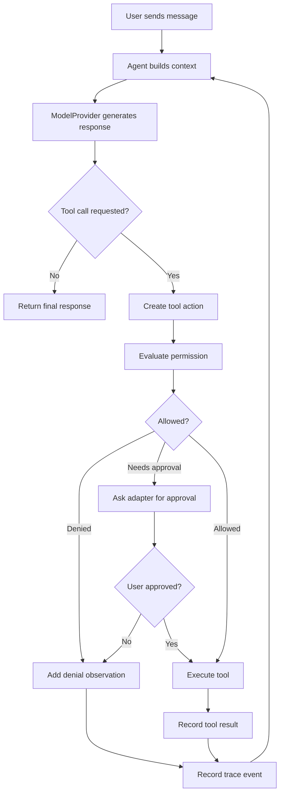

# Agent Loop

Status: Draft
Date: 2026-05-02

Simplified Chinese version: [agent-loop.zh-CN.md](./agent-loop.zh-CN.md)

## 1. Purpose

The agent loop is the runtime cycle that turns a user goal into actions and results.

In Vole, the loop should be simple enough to learn from, but structured enough to evolve into a real general-purpose agent platform.

The MVP loop should answer these questions:

- What did the user ask for?
- Does the agent need tools?
- Which tool should be used?
- Is the tool action allowed?
- What did the tool return?
- What should the agent do next?
- When is the task finished?

## 2. Core Idea

At a high level, the loop is:

```text
User goal
  -> Build model context
  -> Ask model for next step
  -> If model requests a tool, evaluate permission
  -> Execute approved tool
  -> Add observation to context
  -> Repeat until final answer
```

This is the smallest useful shape of a general agent. It lets the model reason over the goal, choose actions, observe results, and continue.

## 3. MVP Loop

The Phase 1 MVP should start with a direct tool-calling loop.



The loop should stop when:

- The model returns a final response.
- The maximum step count is reached.
- A required permission is denied.
- A tool fails in a way the agent cannot recover from.
- The user cancels the task.

## 4. Main Components

### Agent Core

Owns the loop and coordinates the other modules.

Responsibilities:

- Accept a user message or goal
- Build model context
- Call the model provider
- Interpret model responses
- Coordinate tool execution
- Record trace events
- Return final output to the adapter

### Model Provider

Turns structured messages and available tools into a model response.

The core should call `ModelProvider`, not a vendor SDK directly.

### Tool Registry

Provides the list of tools available to the agent and resolves tool calls by name.

The registry should describe:

- Tool name
- Description
- Input schema
- Risk metadata
- Execution function

### Permission Policy

Evaluates whether a tool action can run automatically, needs approval, or must be blocked.

The permission policy returns a decision. It does not ask the user directly. The active adapter handles user interaction.

### Adapter

Presents the loop to a user or external system.

In Phase 1, the adapter is CLI. Later adapters may include Web UI, desktop app, messaging platforms, or background automation.

### Trace Recorder

Records the product-level explanation of what happened during the loop.

The trace should explain the execution process without exposing hidden model reasoning.

## 5. Loop Inputs and Outputs

### Inputs

The loop receives:

- User message or goal
- Session context
- Loaded skills
- Available tools
- Current autonomy mode
- Effective configuration
- Permission policy

### Outputs

The loop returns:

- Final assistant response
- Trace events
- Updated session state
- Tool results that should be persisted
- Any unresolved approval or error state

## 6. Context Building

Before calling the model, the core builds context from:

- System instructions
- Active autonomy mode
- Relevant skill instructions
- Conversation history
- Current plan, if any
- Recent trace summaries
- Available tool descriptions
- User message

The context should be assembled by the core, but each package should own its own contribution:

- `packages/skills` provides selected skill summaries.
- `packages/tools` provides tool descriptions.
- `packages/sessions` provides conversation and trace history.
- `packages/permissions` provides policy language when needed.

## 7. Tool Calling

A model response may contain:

- A final answer
- One or more tool calls
- A request for clarification
- A structured plan update in later phases

The MVP can support one tool call per loop step first. Multiple tool calls can be added later once trace and permission behavior are clear.

Tool execution should follow this sequence:

```text
Parse tool call
  -> Validate tool exists
  -> Validate input schema
  -> Classify action risk
  -> Evaluate permission
  -> Ask adapter for approval if needed
  -> Execute tool
  -> Normalize result
  -> Record trace
  -> Feed observation back into model context
```

## 8. Permission Interaction

The loop must not execute a tool just because the model requested it.

Every tool call passes through permission evaluation:

- Low risk: may run automatically in `confirm` and `auto`
- Medium risk: requires confirmation
- High risk: requires explicit confirmation with risk explanation
- Blocked: denied unless configuration explicitly allows it

Autonomy modes change how much the loop pauses, but they do not remove permission checks.

## 9. Autonomy Modes in the Loop

### `observe`

The loop pauses before most actions and shows what it is about to do. This is best for learning and debugging.

### `confirm`

The loop automatically performs low-risk actions and asks before medium or high-risk actions. This should be the default MVP product mode.

### `auto`

The loop continues without routine interruption inside the permission policy. It still stops for blocked actions, failed tasks, or configured high-risk approvals.

## 10. Execution Trace

Every meaningful step should produce a trace event.

Trace events may include:

- User goal received
- Context built
- Model response received
- Tool selected
- Permission decision made
- User approval requested
- Tool executed
- Tool result observed
- Final response produced
- Error or cancellation occurred

The trace is for product understanding and learning. It should not include hidden chain-of-thought content.

## 11. Event Stream Shape

The runtime should expose the loop as an event stream, not only as one final result.

In TypeScript, Phase 1 uses `AsyncIterable<RuntimeEvent>` for `AgentRuntime.runTurn`. This lets adapters consume each event as the run advances:

```ts
for await (const event of runtime.runTurn(input)) {
  await traceStore.append(event);
}
```

A plain `async` function returning `RuntimeEvent[]` could represent the same events after the run completes, but it would make the CLI, Web UI, trace viewer, permission prompts, and tool progress wait until the whole turn is over. The event stream shape keeps the runtime observable while it is running.

This is also useful for learning: a user can see the agent move from user message, to context assembly, to model request, to assistant message, instead of treating the agent as a black box.

## 12. Planner Evolution

The MVP loop can run without a full Planner. It only needs enough structure to support traceable tool use.

Later phases add planning:

```text
User goal
  -> Create or update plan
  -> Select next step
  -> Run tool/model loop for the step
  -> Observe result
  -> Mark step complete/failed/skipped
  -> Update plan
  -> Continue until task complete
```

The Planner should be introduced as an extension of the loop, not as a separate competing runtime.

### In-Turn Task Tracking — OpenClaw-Aligned Approach

OpenClaw's execute-first philosophy: the model acts immediately and tracks progress as it goes. Two mechanisms make this work:

**1. `update_plan` tool (equivalent to Claude Code `TodoWrite`)**

The model calls `update_plan` during execution to maintain a structured list of task steps and their statuses. This is a full-replace, model-called tool — no infra orchestration. Schema: `{step, status: pending|in_progress|completed}[]`. This is structurally identical to Claude Code's `TodoWrite`.

Vole Phase 4 implements an equivalent `update_todos` tool following the same pattern.

**2. Planning stall detection**

OpenClaw's `pi-embedded-runner` detects "planning-only" turns — model responses that contain planning text (promises, step headings, bullet lists) without executing any tool call. On detection, it injects a retry instruction: *"Act now: take the first concrete tool action you can."* After N retries without action, the run terminates with an error.

Vole Phase 4 adds equivalent stall detection in `AgentRuntime`.

**For long-horizon task decomposition: subagents**

OpenClaw's primary mechanism for truly complex tasks is `sessions_spawn` — spawning background subagents in separate sessions. Subagents run isolated, announce results when complete (push-based), and support an orchestrator pattern (depth up to 2).

This belongs to Vole Phase 7+ when multi-session infrastructure and a gateway exist.

Source: `docs/research/openclaw-implementation-notes.md` Section 8 (third research pass, 2026-05-04).

## 13. Failure Handling

The loop should handle failures explicitly:

- Model provider error
- Invalid tool call
- Unknown tool
- Permission denied
- Tool execution error
- Tool timeout
- Repeated unproductive steps
- User cancellation

MVP behavior can be simple:

- Record the failure in trace
- Explain the failure to the user
- Ask for clarification or stop safely

Later versions can add retries, fallback providers, plan repair, and recovery strategies.

## 14. Step Limits

The loop should have a maximum step count per user turn or task. This prevents runaway execution.

Initial defaults can be conservative:

- Chat turn without tools: 1 model step
- Tool-using turn: limited number of tool loop iterations
- `auto` mode: higher limit, still bounded

The exact numbers can be chosen during implementation.

## 15. Implemented Interfaces and Event Types

The following reflects the actual implemented contracts as of Phase 10.

### RuntimeEvent Types

The runtime emits exactly 17 event types in order:

```ts
type RuntimeEventType =
  | "run_started"                    // user message received
  | "context_assembled"              // system prompt + history built
  | "todos_updated"                  // model called update_todos
  | "planning_stall_detected"        // plan-only turn with no tool calls
  | "model_request_started"          // about to call ModelProvider
  | "token_delta"                    // streaming token chunk
  | "model_request_completed"        // model call finished
  | "tool_call_requested"            // model requested a tool
  | "tool_call_permission_evaluated" // PermissionPolicy returned a decision
  | "approval_requested"             // adapter must ask user
  | "approval_resolved"              // user decision received
  | "tool_started"                   // tool.execute() called
  | "tool_completed"                 // tool returned a result
  | "tool_failed"                    // tool threw an error
  | "assistant_message_created"      // final text response assembled
  | "run_completed"                  // turn finished successfully
  | "run_failed";                    // turn failed
```

### Core Interfaces

```ts
// Agent runtime — the central orchestrator
class AgentRuntime {
  constructor(config: {
    contextAssembler: ContextAssembler;
    modelProvider: ModelProvider;
    systemInstruction: string;
    runtime: { mode: AutonomyMode; workspace: string; currentDate: string };
    tools: ExecutableTool[];
    skillIndex?: ContextSkillSummary[];
    permissionPolicy?: PermissionPolicy;     // defaults to DefaultPermissionPolicy
    approvalResolver?: ApprovalResolver;
    maxSteps?: number;                       // default 12
    maxPlanningStallRetries?: number;
    preferStreaming?: boolean;
    promptMode?: "full" | "minimal" | "none";
    executionContract?: "default" | "strict-agentic";
  });

  runTurn(input: {
    sessionId: string;
    message: string;
    recentMessages?: ModelMessage[];
  }): AsyncGenerator<RuntimeEvent>;
}

// Model provider — vendor-agnostic interface
interface ModelProvider {
  generate(input: ModelInput): Promise<ModelOutput>;
}

// Streaming variant — implemented by AnthropicProvider and OpenAICompatibleProvider
interface StreamingModelProvider extends ModelProvider {
  generateStream(input: ModelInput): AsyncIterable<StreamEvent>;
}

// Tool — capability with risk metadata
interface ExecutableTool {
  name: string;
  description: string;
  inputSchema: ToolInputSchema;
  risk: "low" | "medium" | "high" | "blocked";
  execute(input: unknown, context: ToolExecutionContext): Promise<ToolExecutionResult>;
}

// Permission policy — decide without rendering UI
interface PermissionPolicy {
  evaluate(input: {
    mode: AutonomyMode;
    action: { kind: "tool"; name: string; summary: string; risk: PermissionRiskLevel };
  }): PermissionDecision;
}

// Approval resolver — adapter-side user interaction
interface ApprovalResolver {
  resolve(request: ApprovalRequest): Promise<ApprovalResolution>;
}
```

### Planning Stall Detection

When the model produces a turn with no tool calls and the response text matches planning patterns (promises, step headings, bullet lists), `AgentRuntime` injects a retry instruction:

> "Act now: take the first concrete tool action you can. Do not narrate a plan."

After `maxPlanningStallRetries` consecutive stall turns, the run terminates with `run_failed`.

## 16. Acceptance Criteria

The first agent loop implementation should be considered successful when:

- The CLI can send a user message into Agent Core.
- Agent Core can call a `ModelProvider`.
- The model can return either a final answer or a tool request.
- Tool requests go through validation and permission evaluation.
- Approved tools execute and return observations.
- Observations can be fed back into the model.
- The loop stops safely.
- The user can see an explainable trace of the process.

## 17. Related Documents

- [Main design](../product/vole-design.md)
- [Roadmap](../roadmap/overview.md)
- [Project structure](./project-structure.md)
- [CLI adapter](./cli-adapter.md)
- [Run queue](./run-queue.md)
