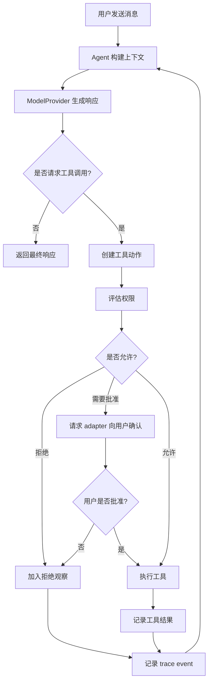

# Agent Loop

状态：草案
日期：2026-05-02

English version: [agent-loop.md](./agent-loop.md)

## 1. 目的

Agent Loop 是把用户目标转化为行动和结果的运行循环。

在 ArvinClaw 中，这个循环要足够简单，便于学习；也要足够结构化，能够演进成真实的通用 Agent 平台。

MVP Loop 需要回答：

- 用户想做什么？
- Agent 是否需要工具？
- 应该使用哪个工具？
- 这个工具动作是否允许？
- 工具返回了什么？
- Agent 下一步应该做什么？
- 任务什么时候结束？

## 2. 核心思路

高层循环：

```text
用户目标
  -> 构建模型上下文
  -> 询问模型下一步
  -> 如果模型请求工具，先评估权限
  -> 执行已批准工具
  -> 把观察结果加入上下文
  -> 重复直到最终回答
```

这是通用 Agent 最小但有用的形态。它让模型可以围绕目标推理、选择动作、观察结果并继续推进。

## 3. MVP Loop

Phase 1 MVP 从直接工具调用循环开始。



循环停止条件：

- 模型返回最终回答。
- 达到最大 step 数。
- 必需权限被拒绝。
- 工具失败且 Agent 无法恢复。
- 用户取消任务。

## 4. 主要组件

### Agent Core

负责循环和模块协调：

- 接收用户消息或目标
- 构建模型上下文
- 调用 model provider
- 解释模型响应
- 协调工具执行
- 记录 trace events
- 向 adapter 返回最终输出

### Model Provider

把结构化消息和可用工具转成模型响应。

Core 调用 `ModelProvider`，不直接调用厂商 SDK。

### Tool Registry

提供 Agent 可用工具列表，并按名称解析工具调用。

Registry 应描述：

- 工具名称
- 描述
- 输入 schema
- 风险 metadata
- 执行函数

### Permission Policy

判断工具动作是可以自动执行、需要批准，还是必须阻止。

Permission Policy 只返回决策，不直接询问用户。当前 adapter 负责用户交互。

### Adapter

把循环展示给用户或外部系统。

Phase 1 中 adapter 是 CLI。后续可以是 Web UI、桌面应用、消息平台或后台自动化。

### Trace Recorder

记录运行过程中发生了什么的产品级解释。

Trace 应解释执行过程，但不暴露隐藏推理。

## 5. 输入和输出

### 输入

Loop 输入：

- 用户消息或目标
- Session context
- 已加载 Skills
- 可用工具
- 当前自主模式
- 有效配置
- 权限策略

### 输出

Loop 输出：

- 最终 assistant 响应
- Trace events
- 更新后的 session state
- 需要持久化的工具结果
- 未解决的批准或错误状态

## 6. 上下文构建

调用模型前，Core 从以下内容构建上下文：

- System instructions
- 当前自主模式
- 相关 Skill instructions
- 对话历史
- 当前计划
- 最近 trace 摘要
- 可用工具描述
- 用户消息

Core 负责组装上下文，但每个包应负责自己的贡献：

- `packages/skills` 提供选中 Skill 摘要。
- `packages/tools` 提供工具描述。
- `packages/sessions` 提供会话与轨迹历史。
- `packages/permissions` 在需要时提供策略说明。

## 7. 工具调用

模型响应可能包含：

- 最终回答
- 一个或多个工具调用
- 澄清请求
- 后续阶段的结构化计划更新

MVP 可以先支持每个 loop step 一个工具调用。等 trace 和权限行为清楚后，再增加多工具调用。

工具执行顺序：

```text
解析工具调用
  -> 验证工具存在
  -> 验证输入 schema
  -> 分类动作风险
  -> 评估权限
  -> 如需要则让 adapter 请求用户批准
  -> 执行工具
  -> 归一化结果
  -> 记录 trace
  -> 把 observation 送回模型上下文
```

## 8. 权限交互

模型请求工具，不代表系统就可以执行工具。

每次工具调用都必须经过权限评估：

- Low：在 `confirm` 和 `auto` 中可以自动执行
- Medium：需要确认
- High：需要明确确认并展示风险说明
- Blocked：默认拒绝，除非配置显式允许

自主模式影响暂停频率，但不能移除权限检查。

## 9. 自主模式

### `observe`

多数动作前暂停，展示将要做什么。适合学习和调试。

### `confirm`

低风险动作自动执行，中高风险动作先询问。应作为 MVP 默认产品模式。

### `auto`

在权限策略内连续执行。仍会因 blocked action、失败任务或配置要求的高风险批准而停止。

## 10. 执行轨迹

每个重要步骤都应产生 trace event。

Trace event 可包括：

- 收到用户目标
- 构建上下文
- 收到模型响应
- 选择工具
- 做出权限决策
- 请求用户批准
- 执行工具
- 观察工具结果
- 产生最终回答
- 发生错误或取消

Trace 用于产品理解和学习，不包含隐藏 chain-of-thought。

## 11. Event Stream 形态

Runtime 应把 loop 暴露为 event stream，而不只是一个最终结果。

在 TypeScript 中，Phase 1 的 `AgentRuntime.runTurn` 使用 `AsyncIterable<RuntimeEvent>`。这让 adapter 可以在 run 推进时逐个消费事件：

```ts
for await (const event of runtime.runTurn(input)) {
  await traceStore.append(event);
}
```

普通 `async` function 返回 `RuntimeEvent[]` 也可以在 run 完成后表达同样的事件，但它会让 CLI、Web UI、trace viewer、permission prompts 和 tool progress 都等到整个 turn 结束后才能看到过程。Event stream 形态让 runtime 在运行中可观察。

这也有助于学习：用户可以看到 Agent 从 user message，到 context assembly，到 model request，再到 assistant message，而不是把 Agent 当成黑盒。

## 12. Planner 演进

MVP Loop 可以没有完整 Planner，只需要支持可追踪工具使用。

后续阶段加入规划：

```text
用户目标
  -> 创建或更新计划
  -> 选择下一步
  -> 为该步骤运行工具/模型循环
  -> 观察结果
  -> 标记步骤完成/失败/跳过
  -> 更新计划
  -> 继续直到任务完成
```

Planner 应是 Loop 的扩展，而不是另一个竞争 runtime。

## 13. 失败处理

Loop 应显式处理失败：

- Model provider 错误
- 无效工具调用
- 未知工具
- 权限被拒绝
- 工具执行错误
- 工具超时
- 重复无效步骤
- 用户取消

MVP 行为可以简单：

- 在 trace 中记录失败
- 向用户解释失败
- 请求澄清或安全停止

## 14. Step 限制

Loop 应为每个用户 turn 或任务设置最大 step 数，避免失控执行。

初始默认值可以保守：

- 无工具 chat turn：1 次模型 step
- 使用工具的 turn：有限的工具循环次数
- `auto` 模式：更高上限，但仍有边界

具体数字在实现计划阶段确定。

## 15. 最小接口草案

```ts
interface AgentRuntime {
  runTurn(input: AgentTurnInput): AsyncIterable<RuntimeEvent>;
}

interface ModelProvider {
  generate(input: ModelInput): Promise<ModelOutput>;
}

interface Tool {
  name: string;
  description: string;
  execute(input: unknown, context: ToolExecutionContext): Promise<ToolResult>;
}

interface PermissionPolicy {
  evaluate(action: ToolAction, context: PermissionContext): PermissionDecision;
}
```

这些是说明性接口，不是最终实现契约。

## 16. 验收标准

第一版 Agent Loop 成功标准：

- CLI 可以把用户消息送入 Agent Core。
- Agent Core 可以调用 `ModelProvider`。
- 模型可以返回最终回答或工具请求。
- 工具请求经过验证和权限评估。
- 已批准工具可以执行并返回 observation。
- Observation 可以回到模型上下文。
- Loop 可以安全停止。
- 用户可以看到可解释执行轨迹。

## 17. 相关文档

- [主设计](../product/arvinclaw-design.zh-CN.md)
- [Roadmap](../roadmap/overview.zh-CN.md)
- [项目结构](./project-structure.zh-CN.md)
- [CLI Adapter](./cli-adapter.zh-CN.md)
- [Run Queue](./run-queue.zh-CN.md)
